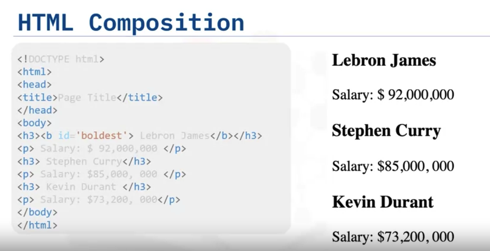

---
module:3
typora-copy-images-to: ./attachments
---

# HTML for Webscraping

[toc]

We will review Hypertext Markup Language or HTML for Webscraping. Lots of useful data are available on web pages, such as real estate prices and solutions to coding questions. The website Wikipedia is a repository of the world's information. If you have an understanding of HTML, you can use Python to extract this information. In this chapter:

- **review the HTML of a basic web page**
- **understand the Composition of an HTML Tag** 
- **understand HTML Trees**
- **understand HTML Tables** 

## HTML Tags

***Question***: Let’s say you were asked to find the name and salary of players in a National Basketball League from the following web page. The web page is comprised of HTML. 

It consists of text surrounded by a series of blue text elements enclosed in angle brackets called tags. The **tags** tell the browser how to display the content. The data we require is in this **text**. 

- The first portion contains the `DOCTYPE html` which declares this document is an HTML document. 

- `<html>` element is the root element of an HTML page
- `<head>` element contains **meta information** about the HTML page. 
- Next, we have the `body`, this is what's displayed on the web page. 
  - This is usually the data we are interested in, we see the elements with an “`h3`”, which means type 3 heading, making the text larger and bold. These tags have the names of the players, notice the data is enclosed in the elements. It starts with a `h3` in brackets and ends in a slash `h3` in brackets. 
  - There is also a different tag “`p`”, which means **paragraph**, each `p` tag contains a player's salary. 

Let’s take a closer look at the composition of an HTML tag. Here is an example of an HTML Anchor tag. 

- It will display IBM and when you click it, it will send you to IBM.com. We have the tag name, in this case, “`a`”. This tag defines a hyperlink, which is used to link from one page to another. 

- It’s helpful to think of each tag name as a class in Python and each individual tag as an instance. 
- We have the **opening or start tag** and we have the **end tag**. This has the tag name preceded by a slash. 
- These tags contain the content, in this case, what’s displayed on the web page. 
- We have the attribute, this is composed of the **Attribute Name** and **Attribute Value**. **In this case it the url to the destination web page**. 

## Inspect HTML

Real web pages are more complex, depending on your browser you can select the HTML element, then click **Inspect**. The result will give you the ability to inspect the HTML. 

There are also other types of content such as CSS and JavaScript that we will not go over in this course. The actual element is shown here. 

## HTML Trees

Each HTML document can actually be referred to as a document tree. Let's go over a simple example. 

Tags may contain **strings** and other **tags**. These elements are the tag’s children. We can represent this as a family tree. Each nested tag is a level in the tree. 

## HTML Tables

Next, let’s review HTML tables. To define an HTML table we have the `table` tag. Each table row is defined with a  `<tr>`  tag, you can also use a table `header` tag for the first row. 

The table row cell contains a set of `<td>` tags, each defines a table cell. 

