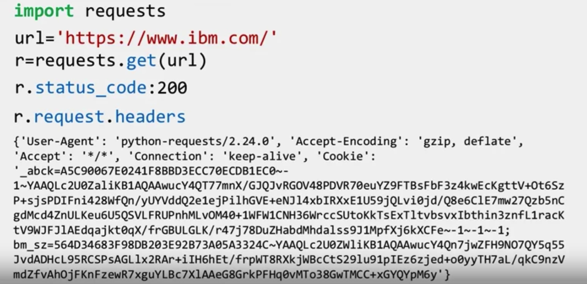

---
module:2
typora-copy-images-to: ./attachments
---

# REST APIs & HTTP Requests - Part2

[toc]

In this chapter, we will:

- Review Python library requests for working with the HTTP protocols. 
- Provide an overview of Get requests and Post Requests.

## Requests in Python

Let's review the `Request` module in Python, this is one of several libraries including: `httplib`, `urllib` that can work with the HTTP protocol.

Requests is a python Library that allows you to **send HTTP/1.1** requests easily. We can import the library as follows: 

You can make a GET request via the method get to www.ibm.com: We have the response object ’r’ , which has information about the request, like the status of the request. 

```python
import requests
url="https://www.ibm.com/"
r=requests.get(url)
r.status_code: 200
```

We can view the status code using the attribute status_code, which is 200 for OK. You can view the request headers: 



You can view the request body in the following line. As there is no body for a GET request, we get a **None**. 

You can view the HTTP response header using the attribute headers. This returns a Python dictionary of HTTP response headers.


We can look at the dictionary values. We can obtain the **date** the request was sent by using the key **Date**. The key Content-Type indicates the type of data. Using the response object ‘r’, we can also check the encoding: As the Content-Type is text/html, we can use the attribute text to display the HTML in the body. We can review the first 100 characters.

## Get Request

You can use the **GET method** to modify the results of your query. For example, retrieving data from an API. In the lab, we will use <u>httpbin.org</u> —— A simple HTTP Request & Response Service.

We send **a GET request** to the server. Like before, we have the **Base URL** in **the Route**; we append  `/get`. This indicates we would like to perform a GET request.

 **This is demonstrated in the following table:**


After GET is requested we have the **query string**. This is a part of a **uniform resource locator** (URL) and this sends other information to the web server.

The start of the query is a question mark (`?`), followed by a series of parameter and value pairs, as shown in the table below.

- The first parameter name is ”name” and the value is ”Joseph.” 
- The second parameter name is ”ID” and the Value is ”123.” 
- Each pair, parameter, and value are separated by an equal sign, ”=.” The series of pairs are separated by the ampersand, ”&.”


**Let’s complete an example in python.** 

We have the <u>Base URL</u> with <u>GET</u> appended to the end. To create a <u>Query string</u>, we use the dictionary payload. The keys are the parameter names, and the values are the value of the Query string. 

- Then, we pass the dictionary payload to the params parameter of the `get()` function.
- We can print out the URL and see the name and values. 
- We can see the request body. As the info is sent in the URL, the body has a value of None. 
- We can print out the status code.


We can view the response as text: We can look at the key **'Content-Type’** to
look at the <u>content type</u>.

As the content 'Content-Type' is in the JSAON, we format it using the method `json()` .

It returns a Python **dict**: The key '<u>args</u>' has the name and values for the  query string.


## Post Request

Like a GET request a POST request is used to **send data to a server**, but the POST request sends the data in **a request body**, not the **url**. 

In order to send the Post Request in the URL, we change the route to POST: This endpoint will expect data and it is a convenient way to configure an HTTP request to send data to a server. 

We have The `payload` dictionary. To make a POST request, we use the `post()` function.

The variable `payload` is passed to the parameter data : 


## Compare POST and GET

Comparing the URL using the attribute url from the response object of the GET and POST request:

- We see the **POST request** has **no name or value pairs** in it’s url.

   

- We can compare the POST and GET request body. 

  - Only the **POST request** has a body: We can view the key form to get the payload.

  