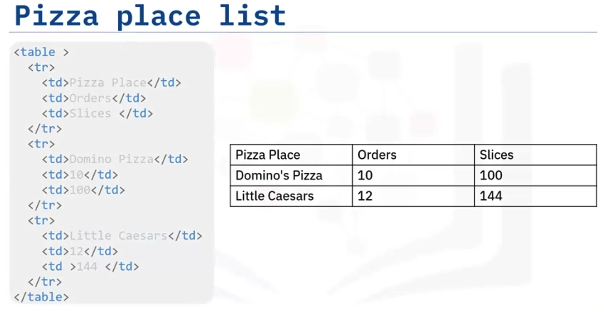

---
module:4
typora-copy-images-to: ./attachments
---

# Webscraping

[toc]

**This chapter's objectives are:** 

- Define web scraping; 
- Understand the role of **BeautifulSoup Objects**;
- Apply the `find_all` method;
- Webscrape a website. 

## Introduction

Webscraping is a process that can be used to automatically extract information from a website, and can easily be accomplished within a matter of minutes and not hours. 

To get started we just need a little Python code and the help of two modules named `Requests` and `BeautifulSoup`. 

Let’s say you were asked to find the name and salary of players in a National Basketball League, from the following webpage. 

We import `BeautifulSoup`. We can store the webpage HTML as a **string** in the variable HTML. 

To parse a document, pass it into **the BeautifulSoup constructor**. 

We get the BeautifulSoup object, soup, which represents the document as a nested data structure. 

## Beautiful Soup Objects

**BeautifulSoup** represents HTML as a set of **Tree-like objects** with methods used to parse the HTML. 

We created the `tag_object` corresponding to an HTML tag in the original document. 

For example, the tag “title.” Consider the tag `<h3>`. 

If there is more than one tag with the same name, the first element with that tag is selected. 

In this case with Lebron James, we see the name is enclosed in the bold attribute "b". To extract it, use the **Tree representation**. 

## HTML Tree

The variable `tag_object` is located here. We can access the child of the tag or navigate down the branch as follows: 

You can navigate up the tree by using the parent attribute. The variable tag child is located here. We can access the parent. This is the original tag object. 

We can find the sibling of “tag_object.” We simply use the `next_sibling` attribute. 

We can find the sibling of `sibling_1`. 

Consider the `tag_child` object. You can access the attribute **name** and value as a key-value pair in a dictionary as follows. 

You can return the content as a Navigable string, this is like a Python string that supports **BeautifulSoup** functionality. 

## Find_all

Review the method `find_all`. This is a filter, you can use filters to filter based on a tag’s **name**, its **attributes**, **the text of a string**, or **some combination of these**. 

Consider the list of **Pizza Places**. Like before, create a **BeautifulSoup** object. But this time, name it **table**. The `find_all ()` method looks through a tag’s descendants and retrieves all descendants that match your filters. 

Apply it to the table with the tag `<tr>`. The result is a Python iterable just like a list, each element is a tag object for `<tr>`. This corresponds to each row in the list- including the table header. 

Each element is a **tag object**. Consider the first row. For example, we can extract the first table cell. 

We can also iterate through each table cell. 

- First, we iterate through the list “table rows,” via the variable row. 
- Each element corresponds to a row in the table. 
- Apply the method `find_all()` to find all the table cells, then we can iterate through the variable cells for each row. 
- For each iteration, the variable cell corresponds to an element in the table for that particular row. 

## A Webpage Example

To scrape a webpage we also need the `Requests` library. 

- The first step is to import the modules that are needed. 

- Use the `get` method from the `requests` library to download the webpage. 
- The **input** is the **URL**. 
- Use the `text` attribute to get the text and assign it to the variable page. 
- Then, create a **BeautifulSoup** object `soup` from the variable page. It will allow you to parse through the HTML page. 

